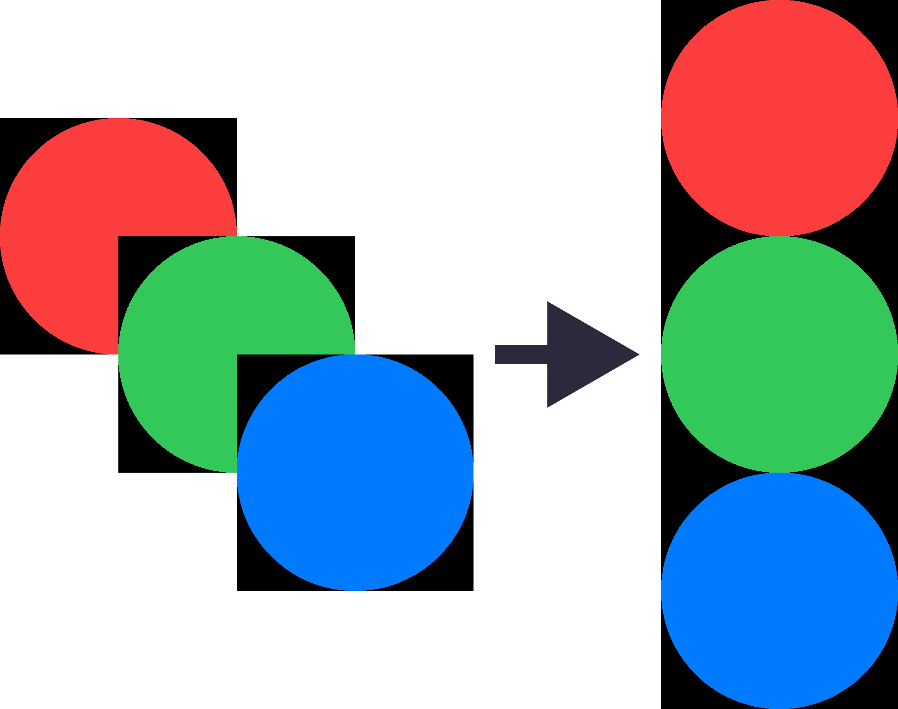
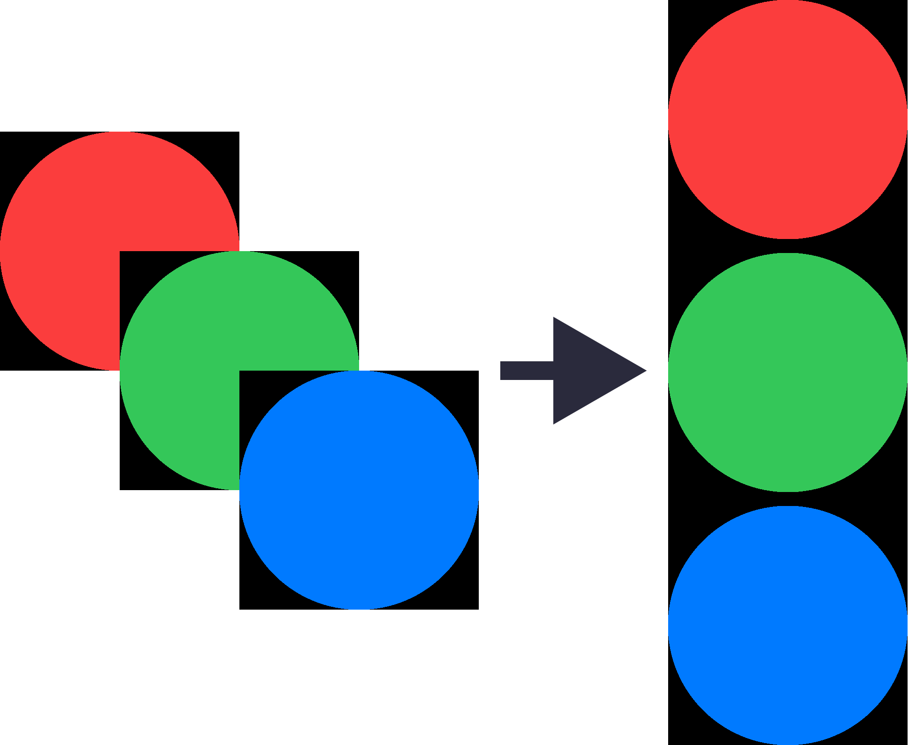

# Changelog
All notable changes to this project will be documented in this file.

## [1.0.27] - 2024/4/4
### Changed
- Updated dependent [sharp](https://sharp.pixelplumbing.com/) package from 0.31.2 to 0.33.3.

## [1.0.26] - 2023/11/15
### Changed
- Image resizing process (Media.resize) no longer creates a temporary file.

## [1.0.25] - 2023/9/2
### Added
- Added validator functions.  
    API details are [here](README.md#api).

    |Function|Description|
    |--|--|
    |[validators.isAfter](README.md#validatorsisafter)|Check if it is an after date.|
    |[validators.isAlpha](README.md#validatorsisalpha)|Check if it is alphabetical (a-zA-Z).|
    |[validators.isAlphanumeric](README.md#validatorsisalphanumeric)|Check if alphanumeric (a-zA-Z0-9).|
    |[validators.isBefore](README.md#validatorsisbefore)|Check if it is an before date.|
    |[validators.isBoolean](README.md#validatorsisboolean)|Check if it is a boolean value.|
    |[validators.isDataURI](README.md#validatorsisdatauri)|Check if the data URI format.|
    |[validators.isDate](README.md#validatorsisdate)|Check if it is a date (e.g., 2023-09-04, 2023/9/4).|
    |[validators.isDecimal](README.md#validatorsisdecimal)|Check if it is a decimal number. For example, 0.1, 0.3, 1.1, 1.00003, 4.0.|
    |[validators.isEmail](README.md#validatorsisemail)|Check if it is an email address.|
    |[validators.isEmpty](README.md#validatorsisempty)|Checks if the length of the string is zero. undefined,null,[],NaN, and false are considered empty.|
    |[validators.isFloat](README.md#validatorsisfloat)|Check if float.|
    |[validators.isFQDN](README.md#validatorsisfqdn)|Check if the domain name is fully qualified (e.g. domain.com).|
    |[validators.isFQDNorIP](README.md#validatorsisfqdnorip)|Check for a fully qualified domain name (e.g. domain.com) or IP (version 4 or 6).|
    |[validators.isHash](README.md#validatorsishash)|Check if it is a hash of the specified algorithm.|
    |[validators.isHexadecimal](README.md#validatorsishexadecimal)|Check if it is a hexadecimal number.|
    |[validators.isHexColor](README.md#validatorsishexcolor)|Check if it is a hexadecimal color code.|
    |[validators.isHSL](README.md#validatorsishsl)|Check if the color is an HSL color based on the CSS Colors Level 4 specification.<br>Comma-separated format supported. Space-separated format supported with the exception of a few edge cases (ex: hsl(200grad+.1%62%/1)).|
    |[validators.isIn](README.md#validatorsisin)|Check if the input value is in an array value, string, or object key.|
    |[validators.isInt](README.md#validatorsisint)|Check if it is an integer.|
    |[validators.isIP](README.md#validatorsisip)|Check for IP (version 4 or 6).|
    |[validators.isJSON](README.md#validatorsisjson)|Check for valid JSON (using JSON.parse).|
    |[validators.isJWT](README.md#validatorsisjwt)|Check if it is a valid JWT token.|
    |[validators.isLength](README.md#validatorsislength)|Check if the length of the string is within the range.|
    |[validators.isLowercase](README.md#validatorsislowercase)|Check for lowercase letters.|
    |[validators.isNumeric](README.md#validatorsisnumeric)|Check if it contains only numbers.|
    |[validators.isPort](README.md#validatorsisport)|Check if it is a port number.|
    |[validators.isRGBColor](README.md#validatorsisrgbcolor)|Check if it is an RGB or RGBA color code.|
    |[validators.isUppercase](README.md#validatorsisuppercase)|Check for uppercase letters.|
    |[validators.isURL](README.md#validatorsisurl)|Check if it is a URL.|
    |[validators.isUUID](README.md#validatorsisuuid)|Check if it is a UUID (version 1, 2, 3, 4, or 5).|

## [1.0.24] - 2023/9/1
### Changed
- Update TypeScript version from 4.9.4 to 5.2.2.
- Updated rollup plugins (rollup-plugin-typescript2, @rollup/plugin-commonjs, @rollup/plugin-node-resolve, @rollup/plugin-terser).

## [1.0.23] - 2023/6/8
### Changed
- Media class now supports PDF.

## [1.0.22] - 2023/4/5
### Changed
- Added margin option to image conversion method (Media.convertImageFormat).
    ```js
    const {Media} = require('nodejs-shared');

    // Add 100px gray margins on top, bottom, left and right.
    const dataUrl = await Media.convertImageFormat('input.jpg', 'output.jpg', {margin: 100, background: 'gray});
    ```

## [1.0.21] - 2023/4/4
### Changed
- Added bmp conversion option to the image conversion method (Media.convertImageFormat).
    ```js
    const {Media} = require('nodejs-shared');

    // Use 24-bit color in the output bmp.
    const dataUrl = await Media.convertImageFormat('input.jpg', 'output.bmp', {trueColor: true});
    ```

### Fixed
- Delete debug logs.

## [1.0.20] - 2023/3/24
### Fixed
- Fixed a bug in the image format conversion method (Media.convertImageFormat()) that caused an error when loading the converted image dataURL.

## [1.0.19] - 2023/3/24
### Changed
- Changed the format of bmp output by the image format conversion method (Media.convertImageFormat()) from BPM V1 to BMP V3.

## [1.0.18] - 2023/3/16
### Changed
- Delete backup files that are no longer needed.

## [1.0.17] - 2023/3/16
### Changed
- Fix API documentation.

## [1.0.16] - 2023/3/16
### Added
- An image format conversion method was added to the media class.
    ```js
    const {Media} = require('nodejs-shared');

    // Get the data URL of the converted image format.
    const dataUrl1 = await Media.convertImageFormat('input.png');

    // In addition to obtaining the data URL, further write the converted image format in the file.
    const dataUrl2 = await Media.convertImageFormat('input.png', 'output.jpg');
    ```
### Fixed
- Fixed a typo that caused two dots in the extension of temporary images created by GIF-related processing in the media class.

## [1.0.15] - 2023/3/1
### Added
- Added a method to the File class to check if a string is valid as a file system path.
    ```js
    const {File} = require('nodejs-shared');

    File.isPath('.');               // true
    File.isPath('aa');              // true
    File.isPath('abc.js');          // true
    File.isPath('/abc/def/ghi.js'); // true
    File.isPath('abc/def/ghi.js');  // true
    File.isPath('*.js');            // false
    File.isPath('!*.js');           // false
    File.isPath('!foo');            // false
    File.isPath('!foo.js');         // false
    File.isPath('**/abc.js');       // false
    File.isPath('abc/*.js');        // false
    ```

### Changed
- The method for retrieving the first frame of a GIF in the Media class can now also process the Data URL of the image.
    ```js
    const {Media} = require('nodejs-shared');

    // Extract the first frame from the GIF Data URL and save it to an image file.
    await Media.extractFirstFrameOfGif('data:image/gif;base64,...', 'first-frame.gif');
    ```
- The method to get the number of frames of a GIF in the Media class can now also process the Data URL of the image.
    ```js
    const {Media} = require('nodejs-shared');

    // Get the number of frames from the GIF Data URL.
    const numberOfFrames = await Media.getNumberOfGifFrames('data:image/gif;base64,...');
    ```
- Added unit tests [here](__tests__/Media.test.js) for a method to convert GIF DataURL to base64 (Media.dataUrlToBase64) and a method to write GID DataURL as an image file (Media.writeDataUrlToFile).
- A unit test for a method to get the type of DataURL (Media.statDataUrl) has been added [here](__tests__/Media.test.js).

## [1.0.14] - 2023/3/1
### Changed
- Fix API reference in README.md.

## [1.0.13] - 2023/3/1
### Added
- Added a method to the Media class to extract and save the first frame of a GIF.
    ```js
    const {Media} = require('nodejs-shared');

    // Write the first frame of sample.gif to first-frame.gif.
    await Media.extractFirstFrameOfGif('sample.gif', 'first-frame.gif');

    // Overwrite sample.gif with the first frame.
    await Media.extractFirstFrameOfGif('sample.gif');
    ```
- Added a method to the Media class to get the number of GIF frames.
    ```js
    const {Media} = require('nodejs-shared');

    // Get the number of frames from a GIF image file.
    const numberOfFrames = await Media.getNumberOfGifFrames('sample.gif');
    ```
- Add a method to the File class to recursively copy directories.
    ```js
    const {File} = require('nodejs-shared');

    File.copyDirectory('/tmp/mydir', '/tmp/newdir');
    ```
- Add a method to the File class to check if it is a directory.
    ```js
    const {File} = require('nodejs-shared');

    if (File.isDirectory('/tmp/mydir'))
        console.log('This is a directory');
    ```

### Changed
- Added unit tests for the newly fixed classes [here](__tests__/Media.test.js).

## [1.0.12] - 2022/12/15
### Changed
- Added changelog and unit test information to README.md.

## [1.0.11] - 2022/12/15
### Added
- Added image merge method.
    Merge vertically:  
    

    Merge horizontally:  
    

    Set 30px margins between images to merge vertically:  
    

    ```js
    const {Media} = require('nodejs-shared');

    const imgs = ['1.png', '2.png', '3.png'];

    // Merge vertically.
    await Media.mergeImages(imgs, 'merged.png', {direction: 'vertical'});

    // Merge horizontally.
    await Media.mergeImages(imgs, 'merged.png', {direction: 'horizontal'});

    // Set 30px margins between images to merge vertically.
    await Media.mergeImages(imgs, 'merged.png', {direction: 'vertical', offset: 30});

    // Set 30px margins between images to merge horizontally.
    await Media.mergeImages(imgs, 'merged.png', {direction: 'horizontal', offset: 30});
    ```

### Changed
- API documentation has been moved from github.io to README.md. 

## [1.0.10] - 2022/10/17
### Fixed
- I am sorry. I forgot to build after fixing the code.

## [1.0.9] - 2022/10/17
### Changed
- Fix typos in the code.

## [1.0.8] - 2022/10/17
### Fixed
- AFixed a bug that prevented SVG files from being read correctly as DataURL strings.
    ```js
    const {File} = require('nodejs-shared');

    File.readAsDataUrl(`sample.svg`);
    ```

## [1.0.7] - 2022/10/11
### Fixed
- Fixed a bug that prevents writing to files when the data part of SVG in data URL format is base64 (data:image/svg+xml;base64,).
    ```js
    const {Media} = require('nodejs-shared');

    const urlEncodedSvg = 'data:image/svg+xml;utf8,...';
    let writtenFilePath = Media.writeDataUrlToFile('upload/urlEncodedSvg', urlEncodedSvg);
    console.log(`Write ${writtenFilePath}`);

    const base64Svg = 'data:image/svg+xml;base64,...';
    writtenFilePath = Media.writeDataUrlToFile('upload/base64Svg', base64Svg);
    console.log(`Write ${writtenFilePath}`);
    ```

## [1.0.6] - 2022/10/11
### Changed
- Fix documentation.

## [1.0.5] - 2022/10/11
### Fixed
- Fixed a bug that prevented the writeDataUrlToFile method of the Media class from writing DataURL format SVG to a file.

## [1.0.4] - 2022/10/11
### Changed
- The writeDataUrlToFile method of the Media class now automatically adds an extension when the output filename does not have one.  
    Also, the return value now returns the file path instead of the Media class.  
    ```js
    const {Media} = require('nodejs-shared');

    // Writes DataURL to a file with the specified extension.
    Media.writeDataUrlToFile('test1.png', 'data:image/png;base64,...');

    // Writes DataURL to files with extensions detected automatically.
    const writtenFilePath = Media.writeDataUrlToFile('test2', 'data:image/png;base64,...');
    console.log(writtenFilePath);
    // =>test2.png
    ```
### Added
- Added method to get Mime type from DataURL.
    ```js
    const {Media} = require('nodejs-shared');

    Media.getMimeTypeFromDataUrl('data:image/png;base64,...');
    // =>image/png
    ```
- Added method to get extension from DataURL.
    ```js
    const {Media} = require('nodejs-shared');

    Media.getExtensionFromDataUrl('data:image/png;base64,...');
    // =>png

    Media.getExtensionFromDataUrl('data:image/jpeg;base64,...');
    // =>jpg
    ```

## [1.0.3] - 2022/8/3
### Added
- Added a method to the Media class to obtain byte size from data URL or base64.
    Get the byte size of data URL:
    ```js
    const {File, Media} = require('nodejs-shared');

    const dataUrl = File.readAsDataUrl('sample.jpg');
    Media.dataUrlByteSize(dataUrl);
    // =>30141
    ```

    Get base64 byte size:
    ```js
    const {File, Media} = require('nodejs-shared');

    const b64 = File.readAsBase64('sample.jpg');
    Media.base64ByteSize(b64);
    // =>30141
    ```

### Changed
- Changed to the correct method name as a function.  
    * Media.writeBase64Image => Media.writeDataUrlToFile
    * Media.isBase64 => Media.isDataUrl
    * Media.convertBase64ToBlob => Media.dataUrlToBase64
    * Media.statBase64 => Media.statDataUrl
    * File.readAsBase64 => File.readAsDataUrl

## [1.0.2] - 2021/10/12
### Changed
- Updated dependent package'sharp'from 0.25.4 to 0.29.1.  
    This update statically links sharp's pre-built libvips binaries, eliminating the need to install Phton.  
    Click [here](https://sharp.pixelplumbing.com/changelog) for sharp change log.

## [1.0.1] - 2020/9/25
### Added
- Added delete directory method to file module.
    ```js
    import { File } from 'nodejs-shared';
    File.deleteDirectory('/sample');
    ````

## [1.0.0] - 2020/7/13
### Added
- First release.

[1.0.1]: https://github.com/takuya-motoshima/nodejs-shared/compare/v1.0.0...v1.0.1
[1.0.2]: https://github.com/takuya-motoshima/nodejs-shared/compare/v1.0.1...v1.0.2
[1.0.3]: https://github.com/takuya-motoshima/nodejs-shared/compare/v1.0.2...v1.0.3
[1.0.4]: https://github.com/takuya-motoshima/nodejs-shared/compare/v1.0.3...v1.0.4
[1.0.5]: https://github.com/takuya-motoshima/nodejs-shared/compare/v1.0.4...v1.0.5
[1.0.6]: https://github.com/takuya-motoshima/nodejs-shared/compare/v1.0.5...v1.0.6
[1.0.7]: https://github.com/takuya-motoshima/nodejs-shared/compare/v1.0.6...v1.0.7
[1.0.8]: https://github.com/takuya-motoshima/nodejs-shared/compare/v1.0.7...v1.0.8
[1.0.9]: https://github.com/takuya-motoshima/nodejs-shared/compare/v1.0.8...v1.0.9
[1.0.10]: https://github.com/takuya-motoshima/nodejs-shared/compare/v1.0.9...v1.0.10
[1.0.11]: https://github.com/takuya-motoshima/nodejs-shared/compare/v1.0.10...v1.0.11
[1.0.12]: https://github.com/takuya-motoshima/nodejs-shared/compare/v1.0.11...v1.0.12
[1.0.13]: https://github.com/takuya-motoshima/nodejs-shared/compare/v1.0.12...v1.0.13
[1.0.14]: https://github.com/takuya-motoshima/nodejs-shared/compare/v1.0.13...v1.0.14
[1.0.15]: https://github.com/takuya-motoshima/nodejs-shared/compare/v1.0.14...v1.0.15
[1.0.16]: https://github.com/takuya-motoshima/nodejs-shared/compare/v1.0.15...v1.0.16
[1.0.17]: https://github.com/takuya-motoshima/nodejs-shared/compare/v1.0.16...v1.0.17
[1.0.18]: https://github.com/takuya-motoshima/nodejs-shared/compare/v1.0.17...v1.0.18
[1.0.19]: https://github.com/takuya-motoshima/nodejs-shared/compare/v1.0.18...v1.0.19
[1.0.20]: https://github.com/takuya-motoshima/nodejs-shared/compare/v1.0.19...v1.0.20
[1.0.21]: https://github.com/takuya-motoshima/nodejs-shared/compare/v1.0.20...v1.0.21
[1.0.22]: https://github.com/takuya-motoshima/nodejs-shared/compare/v1.0.21...v1.0.22
[1.0.23]: https://github.com/takuya-motoshima/nodejs-shared/compare/v1.0.22...v1.0.23
[1.0.24]: https://github.com/takuya-motoshima/nodejs-shared/compare/v1.0.23...v1.0.24
[1.0.25]: https://github.com/takuya-motoshima/nodejs-shared/compare/v1.0.24...v1.0.25
[1.0.26]: https://github.com/takuya-motoshima/nodejs-shared/compare/v1.0.25...v1.0.26
[1.0.27]: https://github.com/takuya-motoshima/nodejs-shared/compare/v1.0.26...v1.0.27